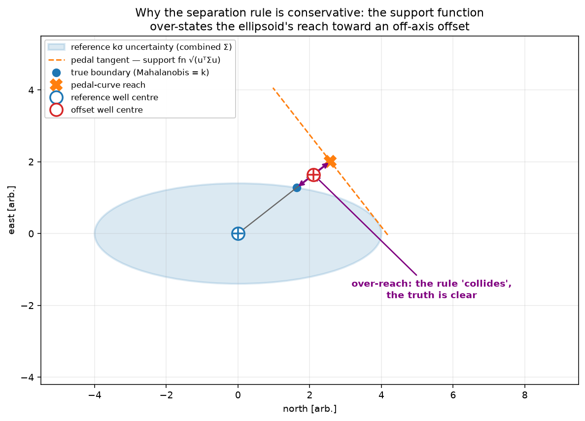

**Preprint — Version 1.0 (2026-06-27)**

---

## Abstract

Wellbore anti-collision is governed by the ISCWSA separation rule (Sawaryn et al., SPE-187073-MS), which expresses risk as a dimensionless separation factor (SF) and is the industry standard for permitting drilling near existing wells. The rule is, by construction, conservative: it characterises the combined positional-uncertainty ellipsoid of the reference and offset wells by its *support function* (the pedal-curve / tangent distance) in the centre-to-centre direction, which always over-states the ellipsoid's true reach toward an off-axis offset. The literature acknowledges this — "overconservative separation rules also have a cost" (SPE-116155) — and that more accurate methods have been considered "impractical for general application because of high conceptual or computational complexity" (SPE-184644).

The exact boundary is **not new**: it is the Mahalanobis distance (Mahalanobis, 1936), brought into wellbore collision by Brooks (2008) after Alfano's satellite-conjunction work, and underlying the analytic collision-probability methods of Bang (2017). Yet the operational standard remains the approximate rule — the exact method having been judged *impractical* "because of high conceptual or computational complexity" (Bang, 2017). **Our contribution is to remove that blocker:** an efficient, validated, open implementation, together with an exact bound on what the approximation costs. We show the conservatism is exactly quantifiable — the rule uses the support function $\sqrt{\mathbf{u}^\top\Sigma\,\mathbf{u}}$ where the correct boundary is the Mahalanobis distance $\sqrt{\mathbf{d}^\top\Sigma^{-1}\mathbf{d}}$, and by the Kantorovich inequality the rule's factor never exceeds the exact one (the gap growing with ellipsoid eccentricity and approach obliquity). We compute the exact boundary as a general, step-free **minimum-Mahalanobis distance between two uncertain parametric curves** — broadphase (the curves' own stations) plus continuous narrowphase, analytic, no mesh — in the open-source library welleng, and validate it: welleng reproduces the published ISCWSA factors to $0.5\%$; the shipped metric agrees with Brooks's Mahalanobis-space transform to floating-point precision (an implementation-consistency check — no third-party Mahalanobis factor exists to match); and the broadphase+narrowphase search matches an exhaustive all-pairs reference to $<2\times10^{-3}$. On the standard set it agrees with the rule on every collision/clear verdict while being up to $1.47\times$ less conservative on the margin, at tens of milliseconds per pair. All data, code and diagnostics are released for full reproducibility. The result lets operators safely reduce standoff — recovering wells that conservatism would forbid and avoiding the cost and production delay of unnecessary additional surveying.

**Notation.** $\Sigma=\Sigma_{\text{ref}}+\Sigma_{\text{off}}$ the combined relative-position covariance (NEV), $\mathbf{d}$ the centre-to-centre vector, $\mathbf{u}=\mathbf{d}/\lVert\mathbf{d}\rVert$, $k$ the confidence multiple ($k=3.5$ in the standard rule), $R$ the combined hole radii plus surface margin $S_m$, $\sigma_{pa}$ the project-ahead term.

---

## 1. Introduction

Drilling near existing wells requires a quantitative anti-collision decision: is the planned (reference) well safely separated from each offset well, given the positional uncertainty of both? The industry standard is the ISCWSA separation rule (Sawaryn et al., SPE-187073-MS), which reduces the decision to a dimensionless **separation factor** (SF): the ratio of the centre-to-centre distance to a minimum-allowable separation derived from the combined positional uncertainty. $\mathrm{SF}<1$ prohibits the activity.

The rule is deliberately conservative — a sound default for a safety-critical decision. But conservatism is not free. SPE-116155 states it plainly: *"Unplanned collisions between oil wells can have catastrophic results, but overconservative separation rules also have a cost."* SPE-121040 notes the need for *"an adequate margin of error without being too conservative and placing unnecessary restrictions on well-design options."* In practice, excess conservatism forces an operator either to **walk away from a well it could have drilled safely**, or to **commission additional or more sensitive surveying** (for example continuous gyro runs or infill survey stations) to shrink the uncertainty enough to pass the rule — which raises cost and **delays first production**, with material negative impact on well economics.

More accurate alternatives exist in principle but have been judged impractical: SPE-184644 observes that *"more advanced methods that overcome such limitations are impractical for general application because of high conceptual or computational complexity."* This paper's contribution is to show that the exact method is neither: it is a closed-form geometric quantity, it runs in milliseconds, and — crucially — it is *validated* and *released open-source* so that any operator can audit and reproduce it.

We make five contributions:

1. We identify and quantify the source of the separation rule's conservatism: the support function over-states the ellipsoid's reach (Section 3), and bound it exactly via the Kantorovich inequality (Section 5).
2. We validate welleng's separation-rule implementation against the published ISCWSA standard set to within $0.5\%$ (Section 4) — establishing that we compute the rule correctly before improving on it.
3. We give the exact combined-covariance, minimum-Mahalanobis $k\sigma$ method, searching the worst point over both interpolated wells, with a project-ahead floor for degenerate geometries (Section 6).
4. We validate it against the rule on the standard set (identical verdicts, up to $1.47\times$ less conservative) and show it is fast (Section 7).
5. We release the implementation, data and diagnostics for full reproducibility (Section 8).

## 2. The separation rule and its geometry

For a reference station the rule forms the **combined relative-position covariance** $\Sigma=\Sigma_{\text{ref}}+\Sigma_{\text{off}}$ — correct because the uncertainty in the *relative* position $\mathbf{P}_{\text{off}}-\mathbf{P}_{\text{ref}}$ of two independently surveyed wells is the sum of their covariances. The minimum-allowable separation along the centre-to-centre direction $\mathbf{u}$ is built from the **pedal radial distance** — the ellipsoid's support function

\begin{equation}
h(\mathbf{u}) \;=\; \sqrt{\mathbf{u}^\top \Sigma\, \mathbf{u}},
\end{equation}

the distance from the ellipsoid centre to the tangent plane with normal $\mathbf{u}$. The separation factor is

\begin{equation}
\mathrm{SF}_{\text{pedal}} \;=\; \frac{\lVert\mathbf{d}\rVert - R}{k\,\sqrt{h(\mathbf{u})^2 + \sigma_{pa}^2}},
\qquad \mathbf{u}=\frac{\mathbf{d}}{\lVert\mathbf{d}\rVert},
\end{equation}

with $k=3.5$, surface margin $S_m=0.3$ m (folded into $R$) and project-ahead $\sigma_{pa}=0.5$ m. The rule documents its own *geometrical limitations*: the closest-approach scan may not select the point of highest collision probability for flattened ellipsoids, and "these limitations may result in significant under, or over-estimation" (SPE-187073). It is, in the words of SPE-184644, *"conservative for situations in which the method is not completely valid."*

## 3. Why the rule is conservative

The support function $h(\mathbf{u})$ is the ellipsoid's extent measured to the *tangent plane* perpendicular to $\mathbf{u}$. The quantity that actually decides whether the offset lies inside the $k\sigma$ ellipsoid is the **Mahalanobis distance** of the offset in the combined-covariance metric,

\begin{equation}
m \;=\; \sqrt{\mathbf{d}^\top \Sigma^{-1}\, \mathbf{d}},
\qquad \text{collision} \iff m < k .
\end{equation}

For an eccentric ellipsoid approached off-axis these differ substantially: the tangent-plane distance over-states how far the ellipsoid actually reaches *along* $\mathbf{u}$. Figure 1 shows the geometry — the offset lies beyond the true ellipsoid boundary (clear) yet within the support-function reach the rule uses (flagged as a collision).

{width=82%}

## 4. Validation of the baseline

Before improving on the rule we confirm we compute it correctly. welleng's `IscwsaClearance` reproduces the **published** separation factors of the ISCWSA standard set of clearance scenarios (reference well plus eleven offsets) to within $0.5\%$ on every well — well inside the documented inter-implementation band. Table 1 lists the minimum separation factors.

\begin{table}[!htbp]
\centering
\begin{tabular}{lrrr}
\hline
Offset & published min SF & welleng min SF & rel.\ err. \\
\hline
01 & 1.400 & 1.400 & 0.12\% \\
02 & 3.627 & 3.627 & 0.12\% \\
03 & 0.457 & 0.457 & 0.12\% \\
04 & 0.397 & 0.396 & 0.23\% \\
05 & 1.195 & 1.195 & 0.26\% \\
06 & 1.029 & 1.029 & 0.01\% \\
07 & 1.633 & 1.633 & 0.06\% \\
08 & 1.272 & 1.272 & 0.16\% \\
09 & 0.010 & 0.010 & 0.12\% \\
10 & -0.607 & -0.607 & 0.50\% \\
11 & 0.226 & 0.226 & 0.12\% \\
\hline
\end{tabular}
\caption{welleng's separation-rule implementation vs the published ISCWSA standard-set minimum separation factors, compared at the tabulated survey stations (worst-case per-station relative error 0.50\%). welleng's between-station interpolation finds slightly lower true minima where the worst point lies between stations (Wells 09: $-0.089$; 11: $0.080$); these are used for the like-for-like comparison against the exact method in Section 7, not here.}
\end{table}

## 5. The conservatism is exactly bounded

Writing $\mathrm{SF}_{\text{exact}}=m/k$ (the radii-adjusted Mahalanobis boundary) and ignoring the small $\sigma_{pa}$ floor, the ratio of the two factors in any approach direction $\mathbf{u}$ is

\begin{equation}
\frac{\mathrm{SF}_{\text{exact}}}{\mathrm{SF}_{\text{pedal}}}
= \sqrt{\big(\mathbf{u}^\top \Sigma\, \mathbf{u}\big)\big(\mathbf{u}^\top \Sigma^{-1}\, \mathbf{u}\big)} \;\ge\; 1,
\end{equation}

by the Kantorovich (Cauchy–Schwarz) inequality, with equality if and only if $\mathbf{u}$ is an eigenvector of $\Sigma$. The rule is therefore *provably conservative* — never optimistic — and the gap grows with ellipsoid eccentricity and approach obliquity. (A separate, larger conservatism arises if two independent $k\sigma$ ellipsoids are meshed and overlap-tested: their surfaces meet at the *linear* sum $k(\sigma_{\text{ref}}+\sigma_{\text{off}})$ rather than the root-sum-square $k\sqrt{\sigma_{\text{ref}}^2+\sigma_{\text{off}}^2}$, a further $\sqrt{2}$ in the symmetric case — avoided here by combining into one ellipsoid.)

Crucially, the reduced conservatism comes from the *metric*, not from under-representing the uncertainty: the exact method evaluates the true ellipsoid boundary directly — there is no surface to shrink. (welleng's *optional* mesh, used for visualisation and multi-well scenes, is deliberately built to err the *other* way and never under-draw the envelope; Appendix A covers it, and recounts how the analytic method emerged, backwards, from that discrete construction.)

## 6. The exact method: minimum Mahalanobis distance between two uncertain curves

The problem is not drilling-specific. Each well is an *uncertain parametric curve*: a position $\mathbf{P}(s)$ and a covariance field $\Sigma(s)$ along a parameter $s$. The separation factor is the minimum, over both curves, of the radii-adjusted Mahalanobis distance in the combined metric:

\begin{equation}
\mathrm{SF} \;=\; \frac{1}{k}\,\min_{s,\,t}\; \sqrt{\mathbf{d}'(s,t)^{\top}\big(\Sigma_{\text{ref}}(s)+\Sigma_{\text{off}}(t)+\sigma_{pa}^2 \mathbf{I}\big)^{-1}\mathbf{d}'(s,t)},
\end{equation}

where $\mathbf{d}'(s,t)$ is the centre-to-centre vector shortened by the combined hole radii and surface margin. This is a continuous two-parameter minimisation, solved to a tolerance — *not* a search on an externally imposed grid. We solve it the way any geometric collision query does, in two phases:

- **Broadphase (locate).** Evaluate the factor at the curves' own survey stations — every reference station against every offset station. The sampling is the geometry's own, so there is no arbitrary step to choose, and the pairing is *exhaustive*, not a Euclidean nearest-neighbour shortlist: the minimum-*Mahalanobis* offset is generally not the Euclidean-nearest one (the rule's "limitation B"), so a shortlist would silently miss it.
- **Narrowphase (refine).** From the lowest broadphase candidates, minimise the factor *continuously* over the two curve parameters, bounded to the neighbouring segments. This converges to a set tolerance — there is no discretisation step, and the worst point, which generally falls *between* stations, is found exactly. Refining several candidates (not only the global broadphase minimum) prevents a sharp crossing from hiding between stations.

The project-ahead floor $\sigma_{pa}^2\mathbf{I}$ keeps the metric finite where a covariance is degenerate (e.g. a near-vertical sidetrack with negligible horizontal uncertainty), so a physical/radii collision is still detected — mirroring the rule's own $\sigma_{pa}$. **Algorithm 1** states the procedure in full.

> **Algorithm 1** — minimum-Mahalanobis separation factor between two uncertain curves.

```
Input:  reference curve R, offset curve O   # each: stations with position P, covariance C, radius r
        confidence k; margins Sm, sigma_pa; candidate count N
Output: separation factor SF

function f(s, t):                  # radii-adjusted Mahalanobis SF between two points
    d = P_O(t) - P_R(s);  D = norm(d)
    if D == 0: return 0
    C  = C_R(s) + C_O(t) + sigma_pa^2 * I
    d' = d * max(D - (r_R(s) + r_O(t) + Sm), 0) / D
    return sqrt( d'^T * inv(C) * d' ) / k

# broadphase: exhaustive over each curve's own stations (not a nearest-neighbour shortlist)
for each reference station i:
    sf[i]    = min    over offset stations j of  f(s_i, t_j)
    jstar[i] = argmin over offset stations j of  f(s_i, t_j)

# narrowphase: continuous refinement of the N lowest candidates
for i in the N stations with smallest sf[i]:
    B     = neighbouring segments of s_i and t_jstar[i]
    sf[i] = min( sf[i], minimize over (s,t) in B of f(s, t) )   # continuous, to tolerance

return min over i of sf[i]
```

Both phases operate directly on the analytic ellipsoid, so there is no surface to mesh and no fixed step to choose: the resolution is **self-derived from the geometry** (the survey's own stations) and the result is **step-free** (an optimiser tolerance), scaling without a domain-specific tuning parameter, in **tens of milliseconds per pair** — several-fold faster than the pedal rule on the same hardware (the absolute time is machine-dependent; the ratio is the durable claim).

Correctness is anchored as follows. The *external* anchor is the separation rule itself: welleng reproduces the published ISCWSA factors to $0.5\%$ (Table 1), so the covariance pipeline and geometry are correct. The exact method then rests on two further checks — because **no third-party Mahalanobis separation factor exists to match** (the standard set publishes pedal factors, not Mahalanobis distances): (i) the metric is computed correctly — our direct eigendecomposition agrees with Brooks's (SPE-116155) Mahalanobis-space transform $\lVert V E^{-1/2}V^\top\mathbf{d}\rVert$ to floating-point precision (Table 2); since these are the *same* quadratic form, this is an implementation-consistency check (two code paths), not external corroboration; and (ii) the search finds the true minimum — the broadphase+narrowphase result agrees with an exhaustive all-pairs reference sampled at $1$ m to $<2\times10^{-3}$ on every well. Finally, the method agrees with the validated pedal rule on every collision/clear verdict of the standard set while remaining $\ge$ it (Kantorovich, Section 5), so it is never optimistic relative to the rule.

| Offset | ours $\sqrt{\mathbf{d}^\top\Sigma^{-1}\mathbf{d}}$ (eigh) | Brooks transform $\lVert V E^{-1/2}V^\top\mathbf{d}\rVert$ |
|---|---|---|
| 01 | 4.954973 | 4.954973 |
| 02 | 13.294141 | 13.294141 |
| 03 | 2.584106 | 2.584106 |
| 04 | 1.555430 | 1.555430 |
| 05 | 6.309519 | 6.309519 |
| 06 | 3.858673 | 3.858673 |
| 07 | 7.795756 | 7.795756 |
| 08 | 6.302172 | 6.302172 |
| 09 | 4.135453 | 4.135453 |
| 10 | 0.000000 | 0.000000 |
| 11 | 1.228445 | 1.228445 |

Table: welleng's Mahalanobis distance computed two ways — directly by eigendecomposition (the shipped `_sf_point`) and via Brooks's (SPE-116155) transform $T=V E^{-1/2}V^\top$ — at each well's closest approach (raw distance; the separation factor rescales by the combined radii and $k$). The two code paths are the same quadratic form and agree to floating-point precision ($<10^{-14}$) on every well: an *implementation-consistency* check that welleng computes Brooks's established measure, not a match against external data (which, for the Mahalanobis factor, does not exist).

For *multi-well scenes* — one planned well against many offsets — a spatial index over the curves' bounding volumes restricts the work to nearby pairs, each then evaluated by the same analytic kernel. A triangulated-mesh realisation is also available (for visualisation, or as a collision-manager scene); its resolution trade-off is in Appendix A.

## 7. Results

On the ISCWSA standard set the exact method returns the **same collision/clear verdict as the validated rule on every well** (Wells 03, 04, 09, 10, 11 collide; 01, 02, 05, 06, 07, 08 clear), while being **less conservative on the margin** — up to $1.47\times$ (Well 03: $\mathrm{SF}$ $0.46\to0.67$; Well 05: $1.20\to1.73$; Well 07: $1.63\to2.18$). Figure 2 contrasts the two across the set. The method is **fast**: tens of milliseconds per well pair, several-fold faster than the pedal rule on the same hardware — well inside the inner loop of batch and automated well planning.

Two conventions are worth noting on the deeply overlapping wells. Where the *centres* lie closer than the combined hole radii plus surface margin ($\lVert\mathbf{d}\rVert < R$) the wellbores physically intersect: the separation rule returns a **negative** factor (its linear numerator $\lVert\mathbf{d}\rVert-R$ goes negative, conveying the depth of overlap), whereas the Mahalanobis factor is non-negative by construction and floors at $0$. Both correctly report a collision; the sign is a property of the rule's linear form, not a disagreement. Well 10 is the reference well's sidetrack: its kickoff intersects the parent by design, so the scan begins below the kickoff (`kop_depth`) — applied identically to *both* methods, and consistent with the published standard-set value.

{width=90%}

The practical reading: where the rule reports, say, $\mathrm{SF}=1.2$ and would demand additional surveying or a redesign, the exact method may report $\mathrm{SF}=1.7$ — clear with margin — recovering a drillable well without acquiring more data.

## 8. The "impractical" objection, refuted

The standing argument against adopting an exact method is that *"more advanced methods that overcome such limitations are impractical for general application because of high conceptual or computational complexity"* (SPE-184644). Every plank of that objection fails for the exact $k\sigma$-boundary method.

- **Conceptual simplicity.** The exact boundary is the Mahalanobis distance (Mahalanobis, 1936) — a single standard quadratic form, $m=\sqrt{\mathbf{d}^\top\Sigma^{-1}\mathbf{d}}$, with collision when $m<k$. It is *simpler* than the rule it replaces, not more complex: the separation rule needs the support function **and** a Euclidean closest-approach scan that carries its own documented exceptions (limitations A and B); the exact method needs neither — one metric, no special cases, no geometrical caveats.
- **Computational cheapness.** The cost is one $3\times3$ linear solve (or eigendecomposition) per station. Measured end-to-end, the method runs in tens of milliseconds per well pair — several-fold *faster* than our own implementation of the pedal rule, and well inside the inner loop of automated trajectory planning. On current hardware the "high computational complexity" is unmeasurable.
- **Generality.** It applies unchanged to every geometry in the ISCWSA standard set — parallel, crossing, oblique, eccentric and the sidetrack — with no special-casing. The support-function / closest-approach machinery, by contrast, carries the limitations the rule itself documents, and SPE-116155 records that *"many computations currently in use fail when the two wells are parallel"*. The Mahalanobis metric is well-defined for every relative geometry, parallel included.

The objection likely conflates two different problems: the full probability-of-collision *integral over the uncertainty volume* (genuinely more involved, and deliberately out of scope here — Section 10) and the exact $k\sigma$-*boundary* (this paper). The boundary question is the very one the separation rule already answers — approximately. Answering it *exactly* is cheaper, simpler and more general than the approximation.

The barrier to adoption was never the mathematics; it was the absence of a validated, openly auditable implementation. Bang (2017) is explicit on this point: of the exact Mahalanobis-space approach he writes that *"to this author's knowledge, the method has not been fully implemented by any company in the petroleum industry."* That gap has persisted — and recent work has largely chosen to refine the *approximation* rather than implement the exact boundary: the error-envelope method (Diao et al., 2025) and the elliptic-cylinder-of-uncertainty method reduce the rule's conservatism for non-parallel wells, but through geometric projection (not the exact metric) and without released code. Diao et al. are themselves explicit that "elliptical column equations provide approximate envelope calculations" and that "future work should develop more precise models." The exact Mahalanobis boundary *is* that more precise model; this paper computes it and releases it — answering both Diao's accuracy call and Bang's implementation gap. (We also note a subtlety these projection methods highlight: the rule is conservative in its *metric* — support function $\ge$ Mahalanobis, Section 5 — yet can be *optimistic* in its *point selection*, evaluating the factor away from the true closest approach; the minimum over both interpolated curves here corrects both.)

## 9. Implementation and reproducibility

The method is implemented in the open-source library welleng (`welleng.clearance.MahalanobisClearance` and `combined_cov_mesh`), with the validated separation rule (`IscwsaClearance`) for comparison. Following the spirit of what reference papers too often omit, *everything required to reproduce every number and figure in this paper is released*: the input wells are the public ISCWSA standard clearance set; the per-station separation factors (published, pedal and Mahalanobis) are provided as a diagnostics file; and the figure- and table-generation scripts are in the repository. The validation is encoded as automated tests.

## 10. Scope and limitations

This work is a **geometric $k\sigma$-boundary** method — it answers "is the offset within the combined $k\sigma$ ellipsoid", the same question the separation rule answers, computed exactly. It is not a probability-of-collision integral over the uncertainty volume; that is a richer, complementary treatment and is left to future work. The covariance model and confidence multiple are inherited from the ISCWSA error model and the chosen $k$; the method changes only how the uncertainty geometry is evaluated, not the uncertainty model itself.

One inherited limitation is worth stating explicitly. The combined covariance $\Sigma_{\text{ref}}+\Sigma_{\text{off}}$ (and equivalently the rule's $\sigma_r^2+\sigma_o^2$) assumes the two wells' errors are **independent**. Where wells share systematic error sources — common reference, tool, or crew — these sums must be modified; as Sawaryn et al. (2019) note, *"a rigorous methodology for this has yet to be developed and this limitation must therefore be regarded as a potential unknown simplification inherent in the present practice."* The exact boundary presented here inherits that assumption unchanged; handling correlated between-well errors is left to future work.

Because both bodies are *analytic* (covariance ellipsoids along curves) and the metric is a quadratic form, the proximity query has a closed-form kernel and needs no surface mesh. This holds for any proximity problem whose bodies admit a tractable distance function (ellipsoids, quadrics, convex primitives); arbitrary non-analytic geometry is out of scope.

## 11. Conclusions

- The ISCWSA separation rule is *provably conservative*: it uses the ellipsoid support function where the exact boundary is the Mahalanobis distance, and by the Kantorovich inequality the rule's separation factor never exceeds the exact one.
- The conservatism is real and quantifiable — up to $1.47\times$ excess standoff on the ISCWSA standard set — and it has a direct economic cost (forgone wells; additional surveying; delayed production).
- The exact combined-covariance, minimum-Mahalanobis method (searching both interpolated wells, with a project-ahead floor and a conservatively *circumscribed* surface) agrees with the rule on every standard-set verdict while reducing conservatism, and runs in milliseconds.
- The objection that accurate methods are "impractical … because of high conceptual or computational complexity" fails on every plank: the exact method is *conceptually simpler* than the rule (one Mahalanobis form, no closest-approach caveats), *several-fold faster* (tens of ms vs hundreds), and *general* across all geometries — validated against the published standard set and released open-source. The barrier to accurate anti-collision was never complexity; it was the absence of an auditable implementation, now removed.

## Appendix A — From a discrete mesh to the analytic solution

This implementation reached its result *backwards*. The usual path discretises an analytic solution for computation; here a discrete construction came first and revealed the analytic one the literature already held.

The first version modelled each well's uncertainty as a triangulated **mesh** — an elliptical tube swept along the trajectory — and tested pairs for overlap with a collision query. A natural prototyping choice, and still how welleng **visualises** uncertainty. Driving down its conservatism (combining the covariances; the exact boundary instead of the support function) and removing its discretisation error led, step by step, to the recognition that the quantity being approximated is simply the Mahalanobis distance — the measure Brooks (2008) and Alfano had used all along. At that point the mesh was no longer needed for the separation factor. The discrete scaffold revealed, for us, the analytic answer the field already had but had not adopted.

Two parts of that scaffold remain useful.

**Honest visualisation.** When the uncertainty envelope is *drawn* rather than queried, the polygonal cross-section must not make the uncertainty look smaller than it is. welleng builds the visualisation polygon **circumscribing** the ellipse — scaled out by $1/\cos(\pi/n)$ so its edges are tangent to, and it fully contains, the true ellipse (Figure 3). An inscribed polygon would under-draw the envelope; the circumscribed one never does.

{width=76%}

**Mesh resolution.** For visualisation, or a multi-well collision-manager scene, the vertex count $n$ trades a closed-form over-conservatism — radial over-count $\sec(\pi/n)-1$, which only ever *adds* margin — against mesh-build cost (Table 3). A typical $n=12$ over-draws by $3.5\%$, a sensible default; $n=24$ brings it under $1\%$. The analytic separation factor of Section 6 carries no such parameter.

| $n$ | radial over-count | area over-count | mesh build [ms] |
|---|---|---|---|
| 6 | 15.5% | 33.3% | 69 |
| 8 | 8.2% | 17.2% | 87 |
| **12** | **3.5%** | 7.2% | 125 |
| 16 | 2.0% | 4.0% | 164 |
| 24 | 0.9% | 1.7% | 240 |
| 48 | 0.2% | 0.4% | 475 |
| analytic | 0% | 0% | 35 (no mesh) |

Table: mesh discretisation over-conservatism (closed-form, from the circumscribed polygon) and build cost vs vertex count $n$. The analytic method carries no discretisation parameter — exact at the lowest cost.

## References

- Mahalanobis, P. C. *On the generalised distance in statistics.* Proceedings of the National Institute of Sciences of India, 2(1), 49–55, 1936.
- Brooks, A. G. and Wilson, H. *An Improved Method for Computing Wellbore Position Uncertainty and its Application to Collision and Target Intersection Probability.* SPE European Petroleum Conference, 1996. doi:10.2118/36863-MS
- Alfano, S. *Satellite Collision Probability Enhancements.* Journal of Guidance, Control, and Dynamics, 29(3), 588–592, 2006. doi:10.2514/1.15523
- Brooks, A. G. *A New Look at Wellbore-Collision Probability.* SPE Drilling & Completion, 25(2), 223–232, 2010 (SPE-116155, presented 2008). doi:10.2118/116155-PA
- Poedjono, B., Lombardo, G. J., Phillips, W. *Anti-Collision Risk Management Standard for Well Placement.* SPE Americas E&P Environmental & Safety Conference, 2009. doi:10.2118/121040-MS
- Bang, J. *Quantification of Wellbore-Collision Probability by Novel Analytic Methods.* SPE Drilling & Completion, 2017. doi:10.2118/184644-PA
- Sawaryn, S. J., Wilson, H., Bang, J., Nyrnes, E., Sentance, A., Poedjono, B., Lowdon, R., Mitchell, I., Codling, J., Clark, P. J., Allen, W. T. *Well-Collision-Avoidance Separation Rule.* SPE Drilling & Completion, 34, 01–15, 2019. doi:10.2118/187073-PA
- Diao, B. et al. *Adjacent well separation factor algorithm considering the wellbore position error envelope.* Journal of Petroleum Exploration and Production Technology, 15:140, 2025. doi:10.1007/s13202-025-02054-z
- welleng (open-source well-engineering library). <https://github.com/jonnymaserati/welleng>
