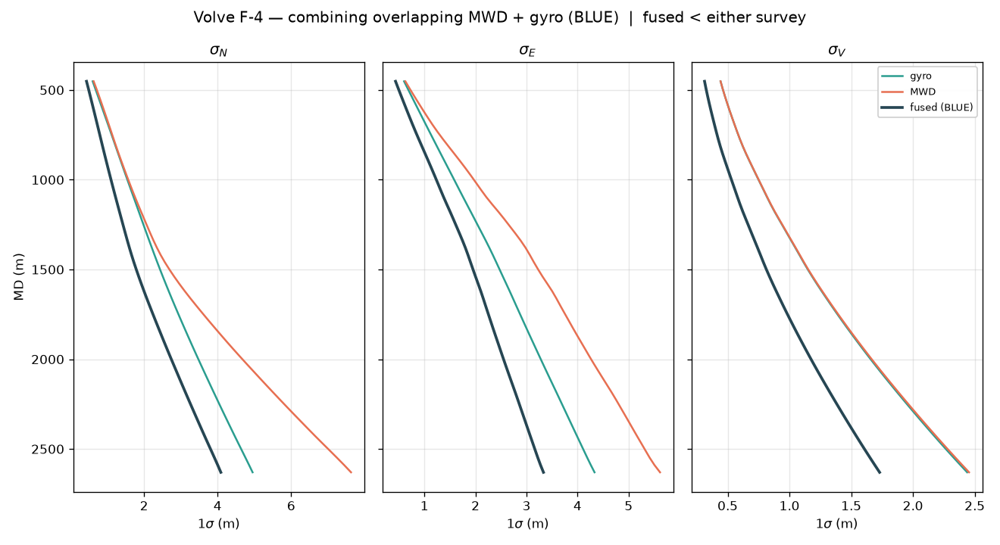
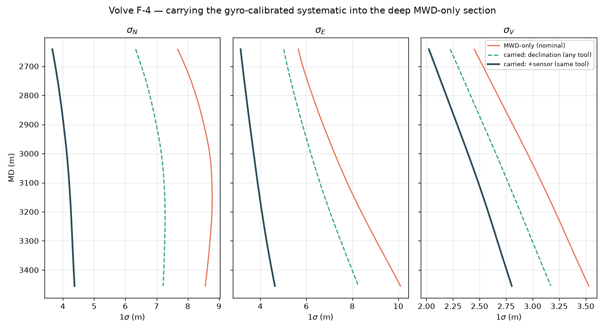

**Version 1.0 — 2026-08-24** · DOI: [10.5281/zenodo.22080774](https://doi.org/10.5281/zenodo.22080774)

## Abstract

When two independent surveys cover an overlapping interval of the same wellbore
— most commonly a measurement-while-drilling (MWD) survey and a gyroscopic
survey — the industry routinely keeps only one and discards the other. The
statistical value of combining them has been recognised for over two decades
(Ekseth, 1998; Bang, 2019) yet remains under-adopted, and open,
reproducible implementations are scarce. This paper does two things with an
open-source implementation (welleng), demonstrated end-to-end on the public
Volve dataset. First, it *combines* overlapping surveys with the best linear
unbiased estimator (BLUE), evaluated on the analytical arc-faithful interior
covariance so the result is continuous in measured depth rather than tied to
survey stations. Second, it *carries the calibration forward*: where a gyro
overlaps the upper part of an MWD run, the gyro constrains the MWD's systematic
(magnetic) error — including terms a magnetic survey cannot observe from its own
data — and, because that systematic realisation persists down-hole, the
constraint reduces the MWD covariance in the deeper, gyro-free section. On Volve
well F-4 the combination reduces the vertical 1-sigma by a factor of 1.4 over
the overlap; carrying the gyro-observed declination forward reduces the deep
MWD-only lateral 1-sigma unconditionally, and by roughly a factor of two when
the same MWD tool is reused below. Neither method is novel — both
adopt established estimation theory — so the contribution is the open
implementation, the analytical/continuous formulation, and the quantified
demonstration on public field data.

## 1. Introduction

The ISCWSA/OWSG error model (Williamson, 2000; ISCWSA Rev 5) propagates a
survey tool's error sources into a per-station position covariance. It treats a
single survey; it says nothing about what to do when two surveys of the same
hole overlap. In practice a definitive survey is assembled by *selecting* the
best tool over each interval and concatenating (a tie-chain), discarding the
redundant overlap data.

That the redundant data carries recoverable accuracy is long established. Ekseth
(1998) called for "a statistical adjustment theory when redundant surveys are
available"; Bang (2019, SPE-195621) sets out the rigorous weighted-averaging
method for combining overlapping surveys and a combined-IPM construction with
inclination/azimuth-dependent weights (building on earlier weighted-averaging
work it reviews); and the ISCWSA record notes the method still "prevents wider
adoption" for want of practical, trusted tooling (60th ISCWSA meeting, 2016). Separately, using an independent gyro to
constrain an MWD's systematic error via statistical estimation was presented at
the 49th ISCWSA meeting (2019), where a magnetic declination error of about
0.5 degrees was recovered by comparing an MWD azimuth against a gyro.

The estimation itself is textbook — the same inverse-covariance fusion and
Kalman/Gaussian conditioning used routinely in multi-sensor data fusion,
geodetic least-squares network adjustment, meteorological data assimilation and
aided inertial navigation. What has limited its adoption in wellbore surveying is
therefore not the mathematics but three practical barriers: the **correlation
bookkeeping** it requires (identifying which error sources the two surveys share,
so the shared part is not wrongly reduced — the recurring "correlation is the
hard part" caution in the ISCWSA record), the **select-and-concatenate
convention** and a well-founded caution about *shrinking* an ellipse of
uncertainty, and the **absence of open tooling**. This paper addresses all three.

It is worth stressing that the correlation bookkeeping is not new machinery. It
is the *same* shared-error accounting already performed when survey legs are
**tied**: joining two sequential runs requires tracking which error sources
(the geomagnetic/declination and reusable-sensor systematics) are common across
the tie so the downstream leg inherits the correlated uncertainty. Standard
survey software — including COMPASS, whose tie handling separates global,
systematic and well-by-well terms — already carries this decomposition. What
combination and forward-carry add is not a new information requirement but a
*different use* of the same shared-term structure: to fuse an overlap
(the cross-covariance $C$ of Section 2) rather than to concatenate. The gap is
therefore one of convention and tooling, not of theory or of missing
information — a survey system able to tie legs already holds what is needed to
combine them.

What is missing is not the theory but an *open, reproducible* implementation and
a demonstration of the achievable benefit on public data. This paper supplies
both, for two operations:

- **Combination** (Section 2): a continuous BLUE fusion of two overlapping
  surveys.
- **Forward-carry** (Section 3): conditioning a survey's systematic error on an
  independent overlapping reference, then carrying the reduced systematic into a
  reference-free section — the aided-inertial-navigation "calibrate then coast"
  pattern applied across survey tools.

Both are demonstrated on Volve well F-4 (Section 4) and shipped in welleng
(Section 5).

## 2. Combining overlapping surveys

Two surveys A and B provide independent position estimates over a common
interval, with per-station covariances $\Sigma_A$ and $\Sigma_B$. The combined
best linear unbiased estimate has covariance

\begin{equation}
\Sigma_c = \Sigma_A - (\Sigma_A - C)\,(\Sigma_A + \Sigma_B - C - C^{\mathsf T})^{-1}\,(\Sigma_A - C)^{\mathsf T},
\tag{1}
\end{equation}

where $C = \operatorname{cov}(x_A, x_B)$ is the cross-covariance from the error
sources the two surveys *share*. Equation (1) is the standard best linear
unbiased estimator for two correlated estimates of one quantity (the
cross-covariance / "tracklet" fusion form, Bar-Shalom et al., 2001, §8.4).
Error components that are fully common-mode do not reduce; only the independent
part is averaged down. When the surveys are independent ($C = 0$ — the case
flagged for every Volve survey tool, whose `correlate` attribute is uniformly
"N"), it collapses to the classic inverse-variance information add
$\Sigma_c = (\Sigma_A^{-1} + \Sigma_B^{-1})^{-1}$ — the weighted-averaging
method of Bang (2019). It is BLUE, not a Kalman filter (there is no
time or sequence — just two estimates of one position).

The two surveys need not be different tool *types*. Two MWD runs combine the same
way — for example when a bottom-hole assembly is pulled part-way through a section
and a new one re-surveys the already-drilled interval (typically while tripping
back to bottom). Because both are magnetic, their **geomagnetic reference error is
shared** (same location, time and model) and is kept common-mode through $C$ — it
does not reduce; only the **independent** parts (the two tools' sensor biases and
the two BHAs' interference and sag) average down. The gain is therefore real but
smaller than an MWD+gyro combination, where the gyro — being
declination-independent — also collapses the geomagnetic term. The same $C$
machinery expresses both cases. *When* the re-survey is run matters, and carries
its own value — see Section 3.

Two surveys rarely share exactly the same station depths, so both must be
brought to a common measured depth. Linearly interpolating the assembled
covariance between stations under-reports the uncertainty — and hence the
separation factor — near doglegs. welleng instead evaluates each survey's
covariance at any measured depth **analytically**: each error source is
propagated onto the minimum-curvature arc through the partial-leg Rodrigues
rotation — the same Rodrigues form of the minimum-curvature interpolation used
in welleng's `MinCurve` (Sawaryn and Thorogood, 2005) — so the covariance is an
analytical function of arc position rather than an interpolation of the
covariance matrix. The combination is therefore
continuous and dogleg-faithful — queryable at any depth in the overlap, on or
off a survey station. (The magnitude of the linear-interpolation error is
quantified in a companion welleng result on the analytical interior
covariance.)

The implementation validates against an independent stacked generalized-
least-squares derivation to a relative tolerance of $10^{-8}$ (covariance and
position), and against a Monte-Carlo oracle (Figure 3A). As an external check,
it reproduces the published result of Bang (2019, SPE-195621), whose "rigorous
averaging" is precisely this $C=0$ fusion: combining two independent surveys of
similar accuracy reduces the one-sigma by the equal-accuracy limit $1/\sqrt{2}$
— a 29.3% reduction, matching Bang's stated "up to 29%". The larger lateral
reductions Bang reports (his combined lateral extent about a third of the
magnetic-only value) arise from a *realistic vendor* continuous-gyro model whose
lateral accuracy exceeds the MWD's; the standard ISCWSA/OWSG gyro model is by
design conservative — poorer than the MWD model — so the gain realised in
practice depends on the actual gyro's quality, and the demonstration below,
which uses the survey tools' own exported error models, is correspondingly a
conservative floor.

## 3. Carrying the calibration forward

A magnetic MWD survey cannot observe some of its own systematic errors from its
own data — magnetic declination and certain sensor biases are degenerate in a
magnetic-only least-squares solution. An independent gyro, being
declination-independent (it references Earth's rotation and gravity, not the
geomagnetic field), breaks that degeneracy: over an overlap it observes the
MWD's realised systematic error directly.

Crucially, that systematic realisation is *the same* over the whole tool run —
it persists into the deeper section the gyro never reached. So the overlap
observation reduces the MWD covariance at depth. With the target's shared
systematic sources giving the cross-covariance $\operatorname{cov}(x_{\text{deep}}, z)$
between a deep station and the overlap observation
$z = x_{\text{MWD}} - x_{\text{gyro}}$, the conditioned deep covariance is the
Schur complement

\begin{equation}
\Sigma_{\text{deep}}' = \Sigma_{\text{deep}} - \operatorname{cov}(x_{\text{deep}}, z)\,\operatorname{cov}(z)^{-1}\,\operatorname{cov}(z, x_{\text{deep}}),
\tag{2}
\end{equation}

with $\operatorname{cov}(z) = H H^{\mathsf T} + \Sigma_{\text{gyro}}^{\text{overlap}} + \Sigma_{\text{MWD,random}}^{\text{overlap}}$
and $H$ the target systematic sources' propagation over the overlap. Equation
(2) is the Gaussian conditional (Schur-complement) covariance — a single Kalman
update step (Bar-Shalom et al., 2001, §5) — i.e. error-state / aided-inertial-
navigation conditioning of a persistent bias state; the joint-covariance Schur
form is used because it inverts the well-conditioned $\operatorname{cov}(z)$
rather than the ill-conditioned observation-noise matrix. The concept is that of
the 49th
ISCWSA meeting (2019); the method is standard aided navigation (GPS-denied
"coasting" of a calibrated inertial system).

**Only sources that persist carry, and persistence is per class.** A source is
correlated between the overlap and the deep section — and therefore carries —
only if it is the *same realisation* in both:

- **Geomagnetic reference (declination, field strength, dip)** is a property of
  the field model at that location and time, not of the tool or the bottom-hole
  assembly (BHA). It persists across *any* bit trip, BHA change, or tool change,
  and it is precisely the error an independent gyro observes best. This carry is
  therefore **unconditional**.
- **Sensor bias, scale and misalignment** are tool-borne: they persist only if
  the **same MWD tool** (sensor package) is reused deeper. A new BHA is fine so
  long as the tool is the same; a *different* tool re-realises these and they do
  not carry.
- **BHA-borne terms (axial magnetic interference, sag)** re-realise with a new
  BHA and do not carry across one.

The implementation selects which classes persist (`persist='global'` for the
unconditional declination carry; `persist=('global','systematic')` when the tool
is reused); a non-persisting source has independent deep/overlap realisations,
contributes nothing to the cross-covariance, and is left at its full value.

**Observability is also geometry-dependent.** The overlap constrains only the
modes it *excites*; a term that matters at depth but is not exercised by the
overlap geometry (a different inclination/azimuth regime) is not carried. The
benefit is bounded by the overlap's observability, not its length alone.

**Timing the re-survey — retrospective versus prospective.** The forward-carry
recasts an operational choice. A re-survey run while tripping *out*, after the
section is drilled, improves only the *final* definitive — a retrospective gain.
A re-survey run while tripping *in* — the overlapping pass an independent tool
(gyro, or simply a fresh MWD) makes over the already-open hole *before* drilling
ahead — lets the reduced systematic be **banked and carried forward into the
interval about to be drilled**. The tighter uncertainty is then available in
real time, while it can still change decisions (anti-collision separation, target
sizing, an intersect approach), not merely at the end of the well. Where survey
accuracy is a live drilling requirement rather than an end-of-well record, the
way-in overlap is worth its rig time precisely because Equation (2) makes the
gain prospective. This is the same combine-then-carry machinery; only *when* the
overlap is acquired changes what it can influence.

The implementation is validated by an independent Monte-Carlo gate in which the
systematic **re-realises** between overlap and deep (a different tool), so only
the persisting (global) source may carry: simulating the true target and
reference errors, forming the overlap observation, and estimating the deep error
with the BLUE gain, the empirical residual covariance matches Equation (2)
(Figure 3B).

## 4. Demonstration on public Volve data (well F-4)

Volve well F-4 carries an MWD survey over the whole run and a stationary gyro
("Wellbore Surveyor") overlapping the upper part, with MWD continuing alone
below about 2640 m. All error models are the exact per-tool IPMs imported from
the public Volve EDM export; the geomagnetic reference is read from the export's
`DP_MAGNETIC` record, so magnetic inputs are identical to the operator's. The
whole demonstration is reproduced by `examples/survey_combination_volve_f4.py`
(Section 5).

**Combination (Figure 1).** Over the overlap the fused 1-sigma sits below both
input surveys on every axis. At the base of the overlap the reduction relative
to the better single survey is 1.2 (north), 1.3 (east) and 1.4 (vertical).

**Forward-carry (Figure 2).** Two cases, by what is assumed to persist. The
**declination carry alone** — unconditional, requiring no assumption about the
deeper BHA or tool — reduces the deep lateral 1-sigma by about 1.2 (north, east)
at total depth. If the **same MWD tool is reused** below (a new BHA is fine),
the sensor systematic carries too and the deep lateral 1-sigma falls by roughly
a factor of two — 2.0 (north), 2.2 (east). The reduction persists through the
entire gyro-free section, because it acts on the systematic realisation the gyro
constrained, not on any measurement the gyro made at depth. (In F-4 the deep
section crosses the 12-1/4-inch to 8-1/2-inch hole-size change, so the same-tool
case assumes the operator re-ran the same MWD sensor package below the shoe —
common practice, but an assumption; the declination carry needs no such
assumption.)

## 5. Open implementation

The methods are in welleng (open source):

- `welleng.combination.fuse_covariances` — BLUE fusion (Equation 1), with the
  cross-covariance for shared terms and a positive-semidefinite guard.
- `welleng.combination.combine_surveys` — continuous combination via the
  analytical interior covariance `Survey.err.cov_nev_at`.
- `welleng.combination.carry_systematic_forward` — the Schur conditioning of
  Equation (2).

Each is a scalar reference implementation (one survey pair in, one result out),
with the correctness gates described above kept as regression tests.

Every number and figure in Section 4 is reproduced by the shipped example
`examples/survey_combination_volve_f4.py` (`python
examples/survey_combination_volve_f4.py`, add `--plot` for the figures). It uses
only public data: the F-4 survey, the two exact per-tool IPM error models and
the magnetic reference are packaged with the repository (derived from the public
Volve EDM export, CC BY 4.0), so no external download is required.

## 6. Limitations

The combination assumes the shared/independent decomposition between the two
tools is modelled correctly; the Volve demonstration uses the export's own
`correlate = N` (fully independent), which is optimistic where the two tools in
fact share a tie-on or grid-convergence term. The forward-carry benefit is
observability-bounded and persistence-bounded (Section 3): only the geomagnetic
reference carries unconditionally, while the sensor systematic carries only if
the same MWD tool is reused below — an operational assumption the analyst must
confirm, and one the EDM export does not record (it carries no tool serial).
Both are demonstrated on one public dataset; broader field validation is future
work.

## 7. Suggestions and future directions

The following are **suggestions**, not validated results — offered because they
follow naturally from the mechanism, but each needs work before it could be
claimed.

- **Shared-surface-location declination (an IFR-from-gyro suggestion).** Wells
  sharing a surface location — a platform, a subsea template, or a land pad —
  share essentially the same geomagnetic model error, so a gyro run on the first
  well constrains a declination error common to the others, and the correction
  could in principle benefit them too.
  This is a form of **in-field referencing (IFR)** — established practice, usually
  from a magnetometer field survey — derived instead from a gyro's true azimuth.
  The comparison must be precise (Jamieson, ISCWSA eBook): standard IFR's
  deliverable is the **crustal correction**, which "vary only on geological
  timescales and therefore can be considered fixed over the lifetime of the
  field" — so it is **not** time-dependent, and neither is a gyro-derived
  equivalent over that field. The main-field secular variation is tracked
  separately by the geomagnetic reference model (BGGM in commercial workflows;
  welleng's own client uses the free WMM/IGRF, and for this reproduction reads
  the operator's stored reference from the EDM directly). The genuinely time-variant
  part is the **diurnal / ring-current disturbance**, corrected in real time by
  **IIFR** (interpolated IFR). A gyro therefore captures the total azimuth error
  (crustal + main-field + the diurnal *at its run time*) directly, and could
  substitute for the **crustal** IFR correction over a platform while also
  delivering an independent survey and the forward-carry — but it does **not**
  replace **IIFR's real-time diurnal correction** for wells drilled at other
  times, nor IFR's **spatially-mapped** crustal correction over a large field.
  Realising the platform-scale idea would require sharing the geomagnetic-
  reference source across wells' error models; it should be framed against
  existing IFR/IIFR methods, not as a new concept.

- **Cost (an open question).** Where a gyro is run for its own sake, the
  declination information is effectively a byproduct; leveraging it across
  contemporaneous platform wells could be a cost-effective complement to a
  dedicated IFR service. Whether it is cheaper overall is operator- and
  case-specific (a standalone gyro run is rig time versus an IFR data service)
  and is not assessed here.

- **Correlation modeling.** The Volve demonstration uses the export's
  `correlate = N`; a per-error-source shared/independent map between the two
  tools (tie-on, grid convergence) would refine the combination where it is not.

## 8. Conclusion

Combining overlapping surveys, and carrying an independent survey's calibration
forward into a reference-free section, recover substantial wellbore-position
accuracy that current select-and-discard practice leaves on the table — a factor
of about two on the deep lateral uncertainty in the Volve F-4 example. The
estimation is textbook; the contribution here is an open, reproducible
implementation, an analytical continuous formulation, and a quantified
demonstration on public field data.

\newpage

## References

- Bang, J. (2019). Practical Method to Benefit from the Improved Accuracy of
  Combining Overlapping Wellbore Surveys. SPE-195621-MS.
  https://doi.org/10.2118/195621-MS
- Bar-Shalom, Y., Li, X.-R., Kirubarajan, T. (2001). Estimation with
  Applications to Tracking and Navigation. Wiley. ISBN 978-0-471-41655-5.
  [BLUE/cross-covariance fusion (§8.4); Kalman/Gaussian conditioning (§5)]
- Codling, J. (2018). Survey-Error Distribution and Its Effect on Collision
  Avoidance. IADC/SPE-189654-MS. https://doi.org/10.2118/189654-MS
- Ekseth, R. (1998). Uncertainties in Connection with the Determination of
  Wellbore Positions. PhD thesis, Norwegian University of Science and
  Technology (NTNU), Trondheim. ISBN 82-471-0218-8.
- ISCWSA (2016). 60th Meeting — Precise Separation Factor calculation proposal.
  https://www.iscwsa.net
- ISCWSA (2019). 49th Meeting minutes — combination of gyroscopic and magnetic
  survey data (statistical estimation of declination). https://www.iscwsa.net
- Sawaryn, S. J., Thorogood, J. L. (2005). A Compendium of Directional
  Calculations Based on the Minimum Curvature Method. SPE Drilling & Completion
  20(1): 24–36. SPE-84246-PA. https://doi.org/10.2118/84246-PA [Rodrigues form
  of minimum-curvature interpolation]
- Torkildsen, T., Håvardstein, S. T., Weston, J. L., Ekseth, R. (2008).
  Prediction of Wellbore Position Accuracy When Surveyed With Gyroscopic Tools.
  SPE Drilling & Completion 23(1): 5–12. SPE-90408-PA.
  https://doi.org/10.2118/90408-PA
- Williamson, H. S. (2000). Accuracy Prediction for Directional Measurement
  While Drilling. SPE Drilling & Completion 15(4): 221–233. SPE-67616-PA.
  https://doi.org/10.2118/67616-PA

_(welleng software concept DOI 10.5281/zenodo.20968887.)_
