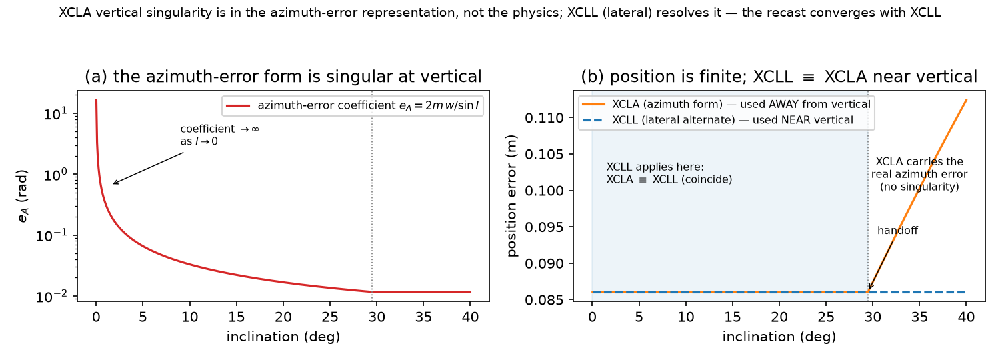
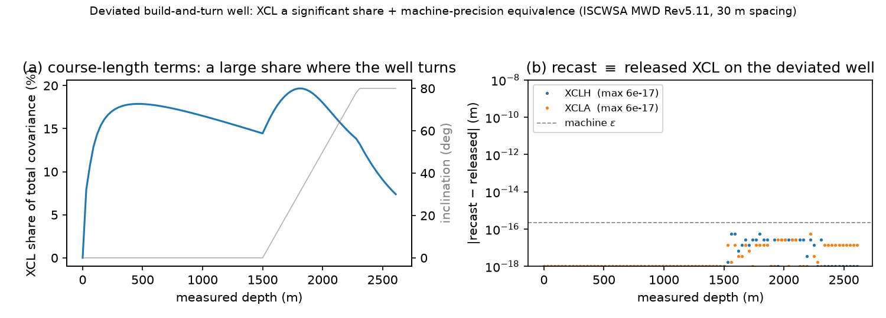

**Cite as:** Corcutt, J. (2026). *The ISCWSA Extended-Course-Length Error as an Own-Only Angle Error.* Zenodo. <https://doi.org/10.5281/zenodo.21901641>

*Version 1.1 (2026): clarifies the `own_only` first-station rule (§4.1) and adds an acknowledgement; no change to the results.*

## Abstract

The ISCWSA error model propagates survey position uncertainty from per-station
inclination/azimuth/depth measurement errors through the minimum-curvature geometry (the
balanced-tangential weighting functions). The **extended-course-length (XCL)** family captures a
real survey-frequency-dependent *model* error — the true slide-rotate wellpath deviates from the
assumed minimum-curvature arc between stations. XCL began, and remained for its entire development,
as **inclination and azimuth weighting-function terms** (proposed by Brooks at the 16th ISCWSA
meeting in 2002 as "inclination and azimuth errors determined from delta inclination and delta
azimuth"; formalised by Codling, SPE-187249-MS, 2017). In 2018 (48th ISCWSA meeting) the committee,
citing unspecified "issues" with the angle-weighting terms, **recast XCL as a position-direct term**
— error vectors applied directly to the survey position, deliberately *outside* the standard
weighting-function machinery (the geometry Jacobians $d\Delta r_k/dp_k$ are not applied; Rev5
Definition §5.2.1). Codling's Rev5 Technical Supplement documents the three structural reasons: XCL
must (i) be attributed to the preceding interval only, not coupled forward through balanced-tangential
propagation; (ii) avoid the azimuth singularity of the angle form at vertical (for which ISCWSA
introduced the lateral alternate **XCLL**); and (iii) be evaluated from true survey points at
interpolated positions. The position-direct form solved these — but at the cost of leaving the
measurement-error architecture: XCL is no longer a samplable measurement perturbation and no longer
a self-contained OSDU error-model formula. It is the one family that forces every generic OSDU/OWSG
engine to carry a bespoke position-direct evaluation path — a named weight function, a cross-station
formula recurrence, and NEV-direct singularity branches — instead of the standard pointwise formula
the rest of the model uses.

We show that the **angle-error form propagated OWN-ONLY** (attributed to the preceding interval,
with no forward coupling) reproduces the position-direct covariance **to machine precision** — the
two are the same covariance. Own-only propagation is exactly what the position-direct form achieves
by bypassing the geometry Jacobian; expressed as an angle error, it stays *inside* the architecture.
We further show the recast handles ISCWSA's other two concerns the same way ISCWSA does — the lateral
treatment at vertical **converges with XCLL**, and the arc-faithful interior from true survey points
matches the interpolated-point rule. The recast is therefore a conformance-exact, in-architecture
restatement of the released position-direct XCL that (a) restores a Monte-Carlo representation (XCL
becomes an own-only measurement-space error, samplable and unified with the other terms), and (b)
collapses XCL's OSDU/OWSG footprint from a bespoke position-direct evaluation path — a named weight
function, a cross-station formula recurrence, and NEV-direct singularity branches, none of which a
generic pointwise formula engine can evaluate — to a **standard inclination/azimuth formula plus one
generic `own_only` flag**. We propose that flag as a minimal, one-field schema addition, and argue it
is far cheaper for any engine to support than special-casing the current position-direct term. We
provide a reference validation workbook.

## 1. Introduction

The ISCWSA error model is a covariance framework: each survey tool's inclination, azimuth and depth
measurement errors are propagated, station by station, through the minimum-curvature geometry to a
$3\times3$ position covariance. Its power is uniformity — every error source is a weighting function
over the measurements, so the same machinery serves conformance testing, Monte-Carlo validation, and
a portable JSON/OSDU model exchange.

The extended-course-length (XCL) family is the exception. It models a genuine and important effect —
between two survey stations the reconstructed minimum-curvature arc is not the path actually drilled;
a slide-rotate sequence deviates from it, and the resulting position error grows with survey interval
and is invisible to a survey that samples too coarsely to observe it. This is a *model* error, not a
tool error, and quantifying it was a two-decade effort within ISCWSA. The term was conceived (Brooks,
2002) and developed (Codling, 2017) as **inclination and azimuth errors** — an angle-error term
fitting the standard architecture. Yet in 2018 the committee, citing unspecified implementation
"issues", recast XCL as a **position-direct** term: error vectors applied straight to the survey
position, deliberately bypassing the weighting-function machinery (the geometry Jacobians
$d\Delta r_k/dp_k$ are not applied; Definition of the ISCWSA Error Model Rev5.13 §5.2.1).

That decision solved the implementation problems (§2), but it made XCL the one family of terms that
stands outside the architecture. A position-direct term has no measurement to perturb, so it has no
Monte-Carlo representation; and it cannot be written as a self-contained OSDU error-model formula — it
requires a bespoke named weight function, a cross-station recurrence, and separate vertical-singularity
branches (§4.1). For a covariance engine built on uniformity, XCL is the term that breaks it.

This paper shows the two forms are reconcilable. The position-direct behaviour ISCWSA adopted —
attributing the error to the preceding interval only, with no forward coupling — is exactly the
**own-only propagation of an angle error**. Written that way, XCL reproduces the released
position-direct covariance to machine precision (§3, Fig. 2), while remaining a measurement-space
term inside the architecture (§4). We do not revisit ISCWSA's decision or its magnitudes; we restate
the released term in a form that is conformance-exact and, additionally, Monte-Carlo-consistent and
reduces XCL to a standard formula plus one proposed generic schema flag (`own_only`) in place of its
bespoke evaluation path (§4.1c). Where ISCWSA's resolution introduced specific fixes — the lateral term **XCLL** for
the vertical azimuth singularity, and evaluation from true survey points at interpolated positions —
the own-only angle-error form **converges with them** (§4.2), which we take as corroboration that the
restatement is faithful rather than a competing proposal.

## 2. XCL: origin, evolution, and the 2018 position-direct decision

**Origin (Brooks 2002).** At the 16th ISCWSA meeting (3 Oct 2002), following Stockhausen's
discussion of "errors caused by failure to correctly survey slide/rotate patterns," Wilson proposed
an error-model term to "provide a more honest estimate of position uncertainty which in turn would
encourage corrective action" — explicitly "not to precisely model the effect in all circumstances."
Brooks then "described a term by which **inclination and azimuth errors are determined from delta
inclination and delta azimuth, divided by a value related to the probable slide-rotate ratio.**" The
founding formulation is an angle-error term.

**Development (2005–2017).** The committee twice set it aside — at the 21st (2005) the majority
agreed that "slide rotate pattern errors need to be dealt with by standard operational procedures
because they can't be adequately modelled" — and twice revived it (34th, 2011; 42nd–43rd, 2015–16,
as Codling operationalised it). At the 46th (Oct 2017) the sub-committee accepted Codling's term for
Rev 5: "The new XCL term has a magnitude of 0.167 and is based on the larger of the survey interval
DLS or a constant tortuosity value… **inclination and azimuth weighting function terms.**" Its
parameterisation is the *actual change in angle* over the interval (Codling, confirming to Willerth,
46th: "It's the actual change in angle, not normalized by a specified course length"). Codling's
SPE-187249-MS (2017) Table 3 gives the two terms "split into inclination and azimuth components,"
each with an *Inclination Weighting* / *Azimuth Weighting* column — designed for the standard
weighting-function machinery.

{width=62%}

**The 2018 pivot (48th) — angle → position-direct.** The committee reported "some initial issues
were uncovered… reasons why these terms are not behaving quite like we want them to. **It was decided
that we need to revise the terms as errors directly applied to the survey positions. They are not
angular errors.**" (Rev 5 was placed on hold; resolved at the 49th, Mar 2019.) The minutes do not
state the specific defect. Codling's Rev5 Technical Supplement documents the resolution — three
structural properties the position-direct form enforces:

1. **No forward coupling.** *"XCL does not use the balanced tangential method… These values do not
   get multiplied by the $d\Delta r_k/dp_k$ matrices like other weighting functions"*; the error is
   *"a cumulative position error from the previous station to the current station."* (Rev5 Definition
   §5.2.1: *"the geometry matrices $d\Delta r_k/dp_k$ … are not used. Instead the error vectors are
   calculated directly."*)
2. **Vertical azimuth singularity.** *"XCLA is singular in vertical hole"*; ISCWSA introduced
   **XCLL** — the lateral alternate to XCLA, used in Compass, to avoid the zero-inclination
   singularity.
3. **Interpolated points from true stations.** *"if interpolated points are added for formation tops
   or casing depths, then like the anti-collision case, uncertainty should be calculated just from
   the true survey points."*

These three are the substance behind "not behaving quite like we want."

## 3. Own-only angle errors reproduce the position-direct covariance

The position-direct move (bypassing $d\Delta r_k/dp_k$, attributing the error to the preceding
interval only) is exactly **own-only propagation of an angle error**: an inclination or azimuth error
at station $k$ acting through the interval $[k{-}1,k]$ alone, with no forward coupling. Written as
such:

- **XCLH $=$ inclination error** $e_I = 0.334\,\max(|\Delta I|,\, \tau\,\Delta\mathrm{MD})$,
  propagated own-only through the standard inclination weight $\partial\mathbf r/\partial I$
  (`drk_dInc`).
- **XCLA $=$ azimuth error** $e_A = 0.334\,\max(|\sin I \sin\Delta A|,\, \tau\,\Delta\mathrm{MD})/
  \sin I$ via $\partial\mathbf r/\partial A$ (`drk_dAz`) away from vertical; at vertical the lateral
  form (§4.2).

**Result (verified, Fig. 2).** The own-only angle-error form reproduces the released XCL station
covariance to machine precision on the ISCWSA test wells — XCLH to $6\times10^{-17}$, XCLA to
$1\times10^{-17}$ — and the full-model total covariance is identical either representation. So the
position-direct term and the own-only angle-error term are **the same covariance**: the recast is a
change of representation, not of result.

{width=100%}

## 4. Consequences — the architecture regained

The position-direct form solved the coupling by leaving the measurement-error architecture. The
own-only angle-error form solves it *within* the architecture, so the architectural properties the
position-direct form gave up are regained:

### 4.1 Uniform propagation, Monte-Carlo, OSDU

**(a) One propagation template.** As an own-only angle error, XCL uses the *same* inclination and
azimuth weighting functions as every other term; the only distinction is a single flag — course-length
terms are attributed to the preceding interval (own-only), measurement terms couple through both
adjacent intervals. There is no separate position-direct code path, no bypass of $d\Delta r_k/dp_k$,
and the between-station interior interpolation that the arc-faithful covariance uses for clearance and
anti-collision applies to XCL automatically (evaluated from the true survey points, §4.2). In a
vectorised implementation the payoff is concrete: with XCL expressed on the uniform weighting surface,
the whole error model contracts as a single fused kernel rather than a dense kernel plus a special-cased
term — the reference implementation realises exactly this (§6).

**(b) A Monte-Carlo representation.** A position-direct term emits an N/E/V vector with no underlying
measurement, so it cannot be sampled — a Monte-Carlo draw would merely re-emit the same vector. The
own-only angle-error form gives XCL a genuine measurement-space quantity to perturb: one samples an
inclination (or azimuth) error and propagates it, exactly as for any measurement term. It is *own-only*,
so the propagation is attributed to the interval alone — a naive coupled Monte-Carlo, propagating the
sampled angle through the full trajectory, over-estimates the covariance substantially (Fig. 3), which
is itself a direct demonstration of the own-only nature. We are explicit about what this does and does
not establish: it makes XCL's *structure* Monte-Carlo-consistent and uniform with the measurement terms;
it does not make the *magnitude* — the $\max(\Delta\text{angle}, \tau\cdot\Delta\mathrm{MD})$ floor —
Monte-Carlo-validated. That magnitude is, and was always intended to be, a stated convention: the
committee's own record describes XCL as a flag to "encourage corrective action", something that "can't
be adequately modelled" and is better handled by operating procedures (16th and 21st meetings). The
recast changes the representation, not that epistemic status.

{width=68%}

**(c) A one-field OSDU schema change, in place of a bespoke evaluation path.** In the OSDU/OWSG
error-model JSON schema (`error_term.json`) a standard term is a self-contained formula — an
inclination/azimuth/depth weighting the engine evaluates pointwise at each station — plus a generic
named weight function. XCLA/XCLH are the only terms that break this. To express the released
position-direct form, the schema and every engine reading it must support machinery that no other
term needs (Listing 1):

- a **bespoke named weight function** (`x_owsg_weight_function: XCLH`/`XCLA`) whose evaluation is
  hard-coded outside the formula grammar (it bypasses the geometry Jacobian and emits an NEV-direct
  vector — not something a formula string can say);
- a **cross-station recurrence** in the formula (`IncPrev`, `AzPrev`, `MDPrev`) reaching back to the
  previous station, which a pointwise evaluator does not carry; and
- **NEV-direct singularity branches** (`north_singularity`/`east_singularity`) for the vertical case.

None of this is expressible in the standard grammar, so a generic engine cannot consume XCL as data —
it must special-case it in code. **We propose the alternative is dramatically cheaper.** Recast as
own-only angle errors, XCLH and XCLA become ordinary inclination/azimuth weighting formulas with the
standard `INC`/`AZ` weight functions. The *only* thing the schema then lacks is a way to say "do not
couple this term forward" — the own-only propagation. That is a **single generic boolean, `own_only`**,
which we propose adding to `error_term.json`. It is term-agnostic (any course-length or misalignment
term can set it, not just XCL), it changes one line of engine logic (skip the forward-coupling sum for
that term), and it replaces the entire bespoke path above. **One optional flag versus a hard-coded
weight function + a recurrence grammar + singularity branches** — the recast is a far smaller ask of
the schema than the term it replaces.

**Listing 1 -- OSDU/OWSG JSON, current vs recast (XCLH shown).** Current (position-direct) -- a
bespoke weight function the engine must hard-code, a cross-station recurrence, and (for XCLA) separate
singularity branches:

```json
{ "name": "XCLH", "x_owsg_weight_function": "XCLH", "value": 0.167,
  "inclination_formula": "Max(Abs(Inc-IncPrev), XCLTortuosity*(MD-MDPrev))",
  "north_singularity": "...", "east_singularity": "...", "propagation_mode": "Random" }
```

Recast (own-only angle error) -- a standard self-contained formula, the generic `INC` weight
function, and the **one proposed schema field** `own_only` (no bespoke weight function, no
singularity branches):

```json
{ "name": "XCLH", "x_owsg_weight_function": "INC", "value": 0.334,
  "inclination_formula": "Max(Abs(Inc-IncPrev), XCLTortuosity*(MD-MDPrev))",
  "own_only": true, "propagation_mode": "Random" }
```

`IncPrev`/`MDPrev` are interval quantities the standard formula grammar already exposes (the delta-inc
weighting is now an ordinary formula, not a recurrence the engine reaches back for). XCLA likewise
becomes a generic azimuth term with `own_only: true`, and the vertical case is carried by ISCWSA's
existing lateral term **XCLL** (§4.2) rather than by NEV-direct singularity branches.

**Proposed schema change.** Add to `error_term.json` an optional boolean `own_only` (default
`false`): when `true`, the reading engine attributes the term's error to the immediately preceding
interval only and does **not** propagate it forward through the remaining trajectory. This is the
minimal, generic addition that lets the standard formula machinery carry XCL (and any future
own-only term) natively, retiring the bespoke position-direct code path.

**First-station rule.** As an *interval* error, an `own_only` term carries **no first-station
contribution and no first-station (surface tie-on) doubling**: it is attributed to the interval
*ending* at each station, so there is no term at the tie-on station itself, and — unlike a true
measurement term — it does not inherit the doubling ISCWSA applies to the first station (Def. of
ISCWSA Error Model §4.7.1.1). The released position-direct XCL carries none; stating this explicitly
in the `own_only` semantics preserves the machine-precision equivalence at the first station. This
refinement was noted by T. Allen (TALLENTECH), who independently reproduced the recast.

### 4.2 XCLA at vertical — convergence with ISCWSA's XCLL
The azimuth-error form is singular at vertical ($1/\sin I$; an azimuth error's lateral position
effect vanishes as $\sin I\to 0$, while the tortuosity floor does not). This is the same singularity
ISCWSA flagged, and the resolution is the same: a **lateral** error at vertical rather than an
azimuth error. **ISCWSA already provides this as XCLL** (the lateral alternate to XCLA used in
Compass). The recast therefore does not introduce a new primitive — it **converges with XCLL**: the
own-only azimuth error away from vertical, XCLL at/near vertical. (We independently reproduced the
XCLL form before locating it in the Rev5 Supplement — corroboration, not novelty.)

{width=100%}

## 5. Results

**Conformance (Fig. 2).** On the ISCWSA MWD Rev5.11 reference wells, the own-only angle-error form
reproduces the released XCL station covariance to machine precision — XCLH to $6\times10^{-17}$ and
XCLA to $1\times10^{-17}$ in the per-station error vector — and the assembled total covariance of the
full error model is identical to $\sim10^{-13}$ under either representation. The recast is therefore
conformance-exact: any implementation that reproduces the published ISCWSA totals with the
position-direct term reproduces them with the own-only angle-error term.

**Own-only, not coupled (Fig. 3).** Sampling the recast inclination error and propagating it own-only
recovers the analytical XCLH covariance to the Monte-Carlo noise floor, whereas propagating the same
sampled error through the full coupled trajectory over-estimates it — the quantitative signature of the
own-only attribution the position-direct form enforces. The position-direct term, having no
measurement, admits neither propagation.

**Vertical behaviour (Fig. 4).** The azimuth-error form's lateral effect scales with $\sin I$ and its
coefficient with $1/\sin I$; the product is finite but the coefficient diverges at vertical. The
lateral form (ISCWSA's XCLL) is the removable-singularity resolution, and the recast coincides with it
below the inclination threshold (§4.2).

**OSDU (Listing 1)** contrasts the current XCL JSON representation with the own-only self-contained
formula; **real-well behaviour (Fig. 5)** confirms the equivalence on a deviated well and shows the
course-length terms' share of the total covariance where they dominate.

{width=100%}

## 6. Discussion — a runnable reference for the committee

The result is deliberately modest in what it changes and specific in what it adds: it does not alter
the released XCL covariance, its magnitude, or ISCWSA's decision to make the term act on the survey
position. It shows that the released behaviour is the own-only propagation of an angle error, and that
writing it as such returns XCL to the standard weighting-function architecture — with the Monte-Carlo
and OSDU consequences of §4, and convergence with ISCWSA's own XCLL and true-station interior rule.

To make adoption frictionless — the recurring concern in the minutes being implementation, not concept
— we provide a reference validation workbook. It is welleng's own work (Apache-licensed, attributing
ISCWSA/OWSG, the SPE sources, and Codling's Technical Supplement as the basis), expresses XCLH/XCLA as
own-only inclination/azimuth weighting terms, and reproduces the published ISCWSA total covariances so
the committee can verify the equivalence in its own spreadsheet format. Its XCL columns cite this
paper's DOI — the same mechanism by which every ISCWSA term cites its source (XCLA/XCLH already cite
Codling, SPE-187249-MS). The proposal to the committee is correspondingly narrow, and its OSDU cost
is a **single optional schema field**: adopt the own-only angle-error *representation* of the existing
Rev5 XCL term as the canonical OSDU form — standard `INC`/`AZ` inclination/azimuth weighting formulas
plus one generic boolean `own_only` in `error_term.json` (§4.1c) — on the basis that it is
conformance-exact, MC-consistent, and expressible in the standard formula grammar, and that it
converges with the XCLL and interpolated-point provisions ISCWSA has already made. That one field
retires the bespoke position-direct evaluation path — a strictly smaller demand on the schema and on
every engine that reads it than the term it replaces.

## 7. Figures

All figures are generated by reproducible scripts in `papers/figures/` against welleng's own error
model, so each figure is itself a check of the claim it illustrates.

- **Figure 1** `fig_xcl_codling_geometry.py` -- slide-rotate excursion set by the survey angle change.
- **Figure 2** `fig_xcl_recast_equivalence.py` -- recast $\equiv$ released XCL covariance to machine precision.
- **Figure 3** `fig_xcl_mc_mapping.py` -- own-only Monte-Carlo (matches) vs coupled (over-estimates).
- **Figure 4** `fig_xcl_vertical_xcll.py` -- XCLA vertical singularity; convergence with XCLL.
- **Figure 5** `fig_xcl_real_well.py` -- deviated-well share + machine-precision equivalence.
- **Listing 1** OSDU JSON, current vs recast (section 4.1).


## Acknowledgements

The author thanks **Timothy Allen (TALLENTECH)**, who independently reproduced the own-only recast in
his own error-model implementation and obtained the same released covariance, and who noted that an
own-only interval term should carry no first-station tie-on doubling — a refinement now reflected in
the `own_only` semantics (§4.1) and in the `welleng` reference implementation.


## References
- Brooks, A. (2002). *Dog Leg Severity Contrast / DLS Error Term.* Minutes of the 16th ISCWSA
  meeting, Houston, 3 Oct 2002. [origin]
- Codling, J. (2017). SPE-187249-MS, *The Effect of Survey Station Interval on Wellbore Position
  Accuracy* (Halliburton; ATCE San Antonio) — the angle-weighting XCL derivation (Fig. 3, Table 3).
- Codling, J. *XCL Terms and Low Angle Misalignments — Technical Supplement* (MWD Error Model Rev5,
  r15; iscwsa.net). [the position-direct resolution + XCLL]
- Definition of the ISCWSA Error Model, Rev 5.13, §5.2.1 (iscwsa.net). [position-direct XCL: geometry
  matrices not applied]
- ISCWSA meeting minutes 46th–49th (2017–2019). [evolution + the 2018 decision]
- (Companion, same 2017 conference: Sentance, Poedjono, Lowdon, Mitchell & Codling, SPE-187073-MS,
  *Well Collision Avoidance — Separation Rule.*)
